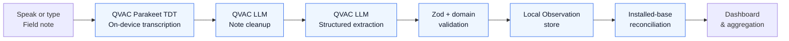
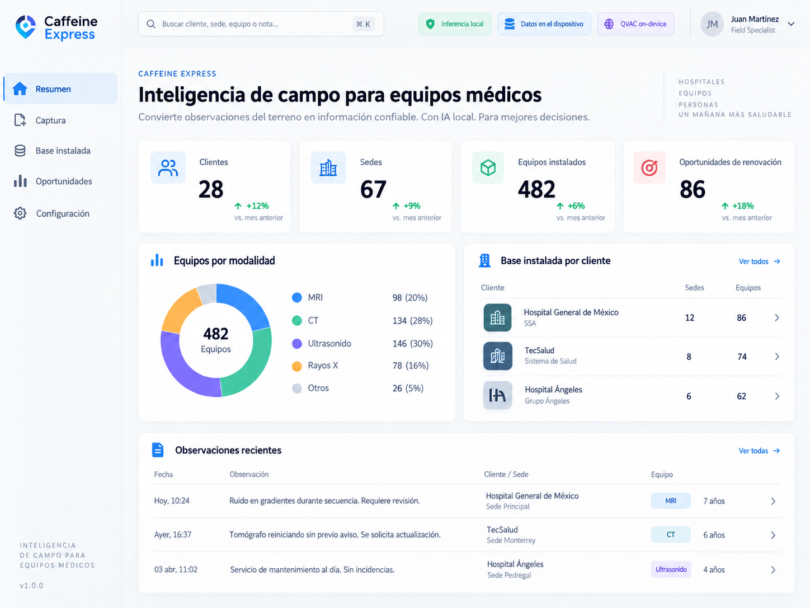
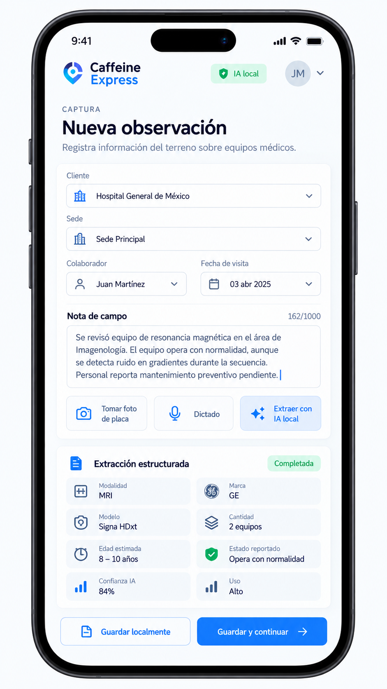
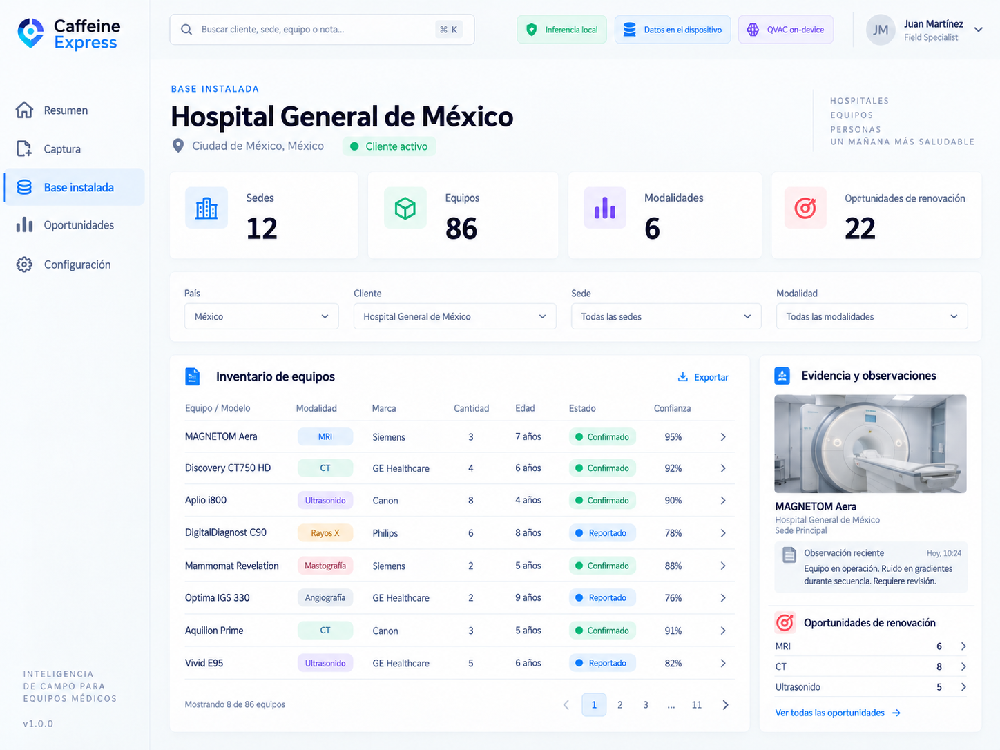
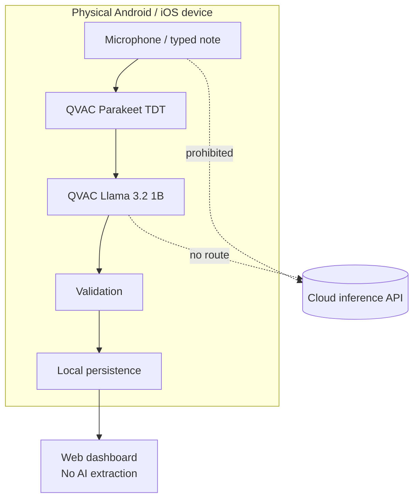
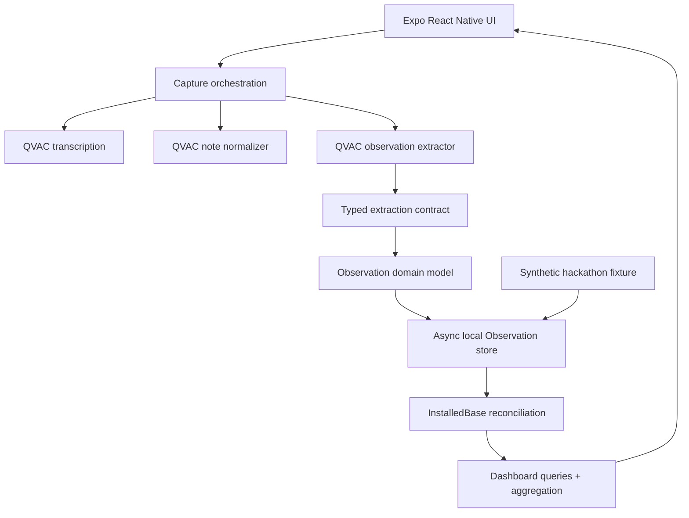
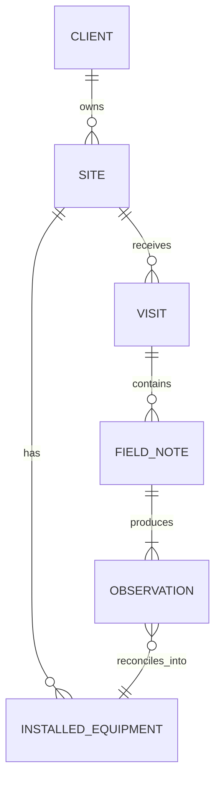

# FieldSight

> **Sovereign field intelligence for installed equipment — captured as a conversation, structured by QVAC, kept on-device.**

FieldSight turns what a field collaborator observes during a customer visit into structured, auditable data about installed equipment. A collaborator can **type or dictate a multilingual Field note**; QVAC transcribes speech locally, cleans the note locally, extracts structured Observations, validates them, persists them, and reconciles them into a live Installed base.

**Decentralized AI Hackathon · ISD Summit 2026 · QVAC**

> [!IMPORTANT]
> **No cloud inference.** AI inference is performed with QVAC on a physical Android/iOS device. Field notes and microphone audio are never routed to an external inference API. The web build is intentionally a dashboard/review surface; native AI capture is demonstrated on a physical device.

---

## The problem

Field teams continuously discover valuable information while visiting customer sites: what equipment is installed, how many units exist, which brands/models are present, how old the equipment appears to be, and how heavily it is used. In practice, this knowledge often remains fragmented across personal notes, chats, spreadsheets, and memory.

That creates four systemic problems:

1. **Capture friction** — structured forms are slow during real field work.
2. **Inconsistent semantics** — the same equipment can be described differently by different people.
3. **Partial or conflicting evidence** — observations are often incomplete and may disagree.
4. **Sensitive context** — customer/site information should not have to leave the device simply to be transformed by AI.

FieldSight treats those constraints as the product architecture, not as edge cases.

## The solution



The collaborator stays in a conversational workflow while FieldSight converts the note into a strict domain model. Unknown information remains **Unknown** instead of being fabricated. Repeated reports strengthen the Installed base through deterministic reconciliation.

## Product experience

### 1. Capture naturally

On a physical Android/iOS device, the collaborator can speak naturally. FieldSight captures microphone PCM locally and sends the in-memory audio directly to **QVAC Parakeet TDT** for multilingual on-device transcription. Typed capture remains available as the simplest deterministic path.

### 2. Clean without changing the facts

The local text-generation model receives the raw transcript and removes speech disfluencies, repairs punctuation, and improves ordering. Its instruction explicitly forbids inventing facts and requires preservation of numbers, negations, uncertainty, brands, models, and locations. The cleaned Field note remains editable before extraction.

### 3. Extract into a strict contract

QVAC transforms the reviewed note into one or more structured Observations containing the fields the challenge requires, including Client/Site context, Modality, brand, model, quantity, Age, Use, and comments when available.

### 4. Validate, persist, reconcile

The model output is not trusted blindly. It passes through typed validation before persistence. Observations then update the local Installed base using deterministic reconciliation rules.

### 5. Inspect the installed base

The dashboard exposes per-Client/Site data, geography, modality, brand/model filters, quantities, state/provenance, confidence signals, and basic portfolio aggregation.

## Screens

| Overview | Mobile capture | Installed base |
| --- | --- | --- |
|  |  |  |

> The capture screen in the current hackathon branch has been further refined to expose the new **Dictate → Transcribe → Clean → Extract** local-AI pipeline. The screenshots above remain design references for the overall visual system.

---

## Why QVAC / why the edge

A field collaborator may be working with unstable connectivity and sensitive customer context. Sending the note to a remote LLM would make availability and privacy depend on external infrastructure and would violate the hackathon's core technical constraint.

FieldSight therefore has a hard inference boundary:



The boundary is both architectural and testable:

- Native QVAC runtime: [`src/capture/qvac-runtime.native.ts`](src/capture/qvac-runtime.native.ts)
- Multilingual transcription: [`src/capture/qvac-transcription.native.ts`](src/capture/qvac-transcription.native.ts)
- Note cleanup: [`src/capture/field-note-normalizer.native.ts`](src/capture/field-note-normalizer.native.ts)
- Structured extraction contract: [`src/capture/qvac-contract.ts`](src/capture/qvac-contract.ts)
- No-cloud guard: [`scripts/check-no-cloud-inference.mjs`](scripts/check-no-cloud-inference.mjs)
- Architecture decision: [`docs/adr/0001-on-device-qvac-inference.md`](docs/adr/0001-on-device-qvac-inference.md)
- Runtime/smoke documentation: [`docs/qvac/runtime-and-smoke.md`](docs/qvac/runtime-and-smoke.md)

## Architecture



For the rationale and component boundaries, see [`docs/architecture.md`](docs/architecture.md).

## Domain model

FieldSight deliberately distinguishes raw evidence from resolved knowledge:



Key concepts are defined precisely in [`CONTEXT.md`](CONTEXT.md):

- **Field note** — raw typed or transcribed natural-language evidence.
- **Observation** — one persisted structured claim about an equipment group.
- **State** — provenance (`Reported`, `Estimated`, `Confirmed`, `Unknown`), not a generic quality score.
- **Installed equipment** — reconciled Site × Modality × brand × model identity.
- **Installed base** — live resolved view across Clients/Sites/geographies.

## Native AI pipeline

| Stage | Runtime | Model / mechanism | Network required for inference? |
| --- | --- | --- | --- |
| Voice capture | Device | `expo-audio` PCM stream | No |
| Transcription | QVAC | Parakeet TDT 0.6B | No |
| Transcript cleanup | QVAC | Llama 3.2 1B Instruct Q4 | No |
| Structured extraction | QVAC | Llama 3.2 1B Instruct Q4 | No |
| Validation | Device | TypeScript + Zod/domain rules | No |
| Persistence | Device | Async local store | No |
| Dashboard | Device/Web | Deterministic application logic | No AI inference |

The application may require connectivity the first time model artifacts or development dependencies are obtained. That is distinct from inference: once the runtime/model is available locally, the AI path does not call a cloud inference service.

---

## Run locally

### Prerequisites

- Node.js 24 recommended for parity with CI.
- npm.
- For the dashboard only: a modern web browser.
- For QVAC AI capture: **physical Android API 29+ or iOS device** and an Expo development/release build containing the native QVAC modules.
- Microphone permission for dictation.

### Install

```bash
git clone https://github.com/quantumquirkxyz/FieldSight.git
cd FieldSight
git checkout hackathon-final-pass
npm ci
```

### Start the Expo development server

```bash
npm start
```

Then choose the target platform from Expo, or run explicitly:

```bash
npm run android
npm run ios
npm run web
```

### Web mode

```bash
npm run web
```

Web mode is useful for the Overview and Installed-base dashboard. It deliberately **does not emulate or replace QVAC inference**. The capture UI explains that native inference is available on a physical mobile device.

### Native QVAC mode

The text model is configured by `src/capture/qvac-config.native.ts` and loaded through `src/capture/qvac-runtime.native.ts`. On startup, the native app loads the QVAC text-generation model. Dictation additionally loads Parakeet for the transcription operation and unloads it after use to keep memory pressure bounded.

A typical native demo path is:

```text
Open Capture
   ↓
Tap “Dictar observación”
   ↓
Speak naturally
   ↓
Stop recording
   ↓
Parakeet transcribes locally
   ↓
QVAC LLM cleans/reorders locally
   ↓
Review/edit Field note
   ↓
Extract structured Observation
   ↓
Open Installed base
```

## Verification

Run the complete submission-facing verification suite:

```bash
npm run verify
```

Equivalent individual commands:

```bash
npm run check:no-cloud   # deterministic cloud-inference boundary guard
npm run typecheck        # TypeScript static verification
npm test                 # contract/runtime/store/dashboard tests
npm run export:web       # production-style Expo web export
npm run build            # TypeScript emit
```

### Real-model smoke test

Where the QVAC host runtime is supported:

```bash
node scripts/qvac-host-smoke.mjs
```

The smoke script loads `LLAMA_3_2_1B_INST_Q4_0`, executes the same structured extraction prompt used by the product, validates the returned JSON contract and expected semantics, retries within a bounded policy, unloads the model, and exits non-zero on failure.

The repository history includes successful repeated real-model smoke runs for the extraction contract; CI separately protects the deterministic no-cloud/type/test/web-build gates. Device-specific microphone + Parakeet behavior must still be validated on the physical device used for the demo because CI cannot emulate the native QVAC worker or microphone hardware.

---

## Repository structure

```text
FieldSight/
├── src/
│   ├── capture/          # QVAC runtime, transcription, normalization, extraction
│   ├── dashboard/        # installed-base projections and aggregation
│   ├── domain/           # canonical business/domain model
│   ├── fixtures/         # deterministic synthetic challenge seed
│   ├── layout/           # responsive shell/navigation
│   ├── screens/          # Overview, Capture, Installed Base
│   ├── store/            # local Observation persistence + reconciliation
│   ├── ui/               # design tokens and reusable components
│   └── validation/       # validation rules
├── docs/
│   ├── adr/              # architecture decision records
│   ├── hackathon_rules/  # supplied challenge references/fixture
│   ├── qvac/             # QVAC runtime and contract documentation
│   ├── research/         # supporting research notes
│   └── ui-reference/     # product UI references
├── scripts/              # compliance and real-model verification tools
├── CONTEXT.md            # canonical product/domain vocabulary
├── JUDGING.md            # rubric mapping + demo checklist
└── README.md
```

## Hackathon evaluation map

| Criterion | Weight | FieldSight evidence |
| --- | ---: | --- |
| **Technical** | **35%** | QVAC native inference, Parakeet dictation, strict contract validation, local persistence, no-cloud guard, tests, real-model smoke path |
| **Innovation** | **25%** | Conversation → structured installed-base intelligence while retaining uncertainty/provenance |
| **Impact** | **20%** | Converts distributed field knowledge into actionable account/site visibility without centralizing sensitive notes for AI inference |
| **Design** | **10%** | Responsive dashboard, focused capture flow, editable AI intermediate result, explicit runtime/privacy state |
| **Completion** | **10%** | End-to-end capture → validation → persistence → reconciliation → dashboard flow with deterministic fixture and judge-facing verification |

See [`JUDGING.md`](JUDGING.md) for the recommended sub-five-minute evaluation flow.

## Data and privacy posture

- The included workbook is a **synthetic fixture**, not production customer data.
- Missing information is represented explicitly instead of being invented.
- Raw voice is processed in memory for the dictation path and is not intentionally uploaded to an inference provider.
- The no-cloud guard is designed to detect prohibited inference-client patterns in the repository.
- Production deployment would still require the organization's normal security, data-retention, access-control, device-management, and regulatory review.

## Scope and roadmap

### Implemented / submission path

- Typed natural-language capture.
- Multilingual on-device dictation pipeline.
- Local transcript cleanup before extraction.
- QVAC structured extraction.
- Strict typed validation and incomplete-data handling.
- Observation persistence.
- Installed-base reconciliation.
- Dashboard filtering and aggregation.
- Synthetic fixture replay.
- No-cloud compliance guard and automated verification.

### Deliberately deferred

- Camera/plate capture and OCR/VisionPsy.
- Automatic follow-up dialogue for unresolved fields.
- P2P synchronization and independent peer confirmation.
- Advanced natural-language portfolio queries.
- Production identity/access control and fleet deployment.

Keeping these outside the critical submission path reduces demo risk while preserving a clear post-hackathon product direction.

---

## Preexisting base — required declaration

Per the Decentralized AI Hackathon rules, the following preexisting bases/components are explicitly declared. The substantial challenge product work — domain contract, QVAC capture path, validation, persistence/reconciliation, dashboard, dictation integration, compliance guard, and judge-facing application flow — is developed as the hackathon solution.

- **quirk Skills workflow bundle** — `.agents/skills/`, `.claude/skills/`, and `skills-lock.json`; agent/tooling infrastructure, not product logic.
- **Expo / React Native scaffold and third-party libraries** — including Expo, React, React Native/Web, Zod, Lucide, AsyncStorage, `expo-audio`, and project configuration.
- **QVAC platform** — official challenge stack and model artifacts supplied through `@qvac/sdk`, including the configured Llama text model and Parakeet transcription model.
- **Synthetic fixture workbook** — `docs/hackathon_rules/Dummy_Installed_Base_Hackathon.xlsx`, supplied as challenge seed/acceptance reference.
- **Repository foundations** — prior scaffold/history documented by this repository, including `docs/`, `CONTEXT.md`, and earlier branch history.

This section is intentionally explicit because omission of a preexisting base is a disqualifying condition in the competition rules.

## Documentation index

- [`docs/problem-statement.md`](docs/problem-statement.md) — problem and minimum challenge scope.
- [`docs/proposal-solution.md`](docs/proposal-solution.md) — broader product proposal and design reasoning.
- [`docs/architecture.md`](docs/architecture.md) — runtime/component/data-flow architecture.
- [`docs/qvac/runtime-and-smoke.md`](docs/qvac/runtime-and-smoke.md) — QVAC execution and smoke verification.
- [`docs/adr/`](docs/adr/) — architecture decisions.
- [`CONTEXT.md`](CONTEXT.md) — canonical domain vocabulary.
- [`JUDGING.md`](JUDGING.md) — rubric evidence, demo order, and final submission checklist.

---

### Built for the Decentralized AI Hackathon 2026

**FieldSight — useful field intelligence without surrendering the field data.**
