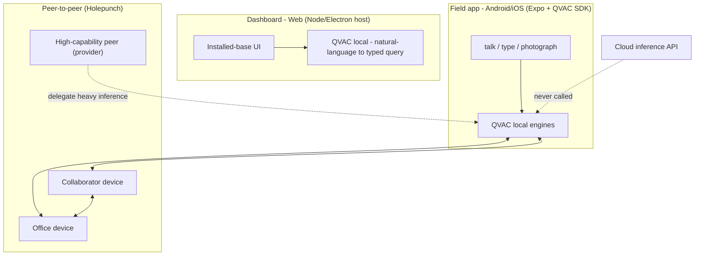
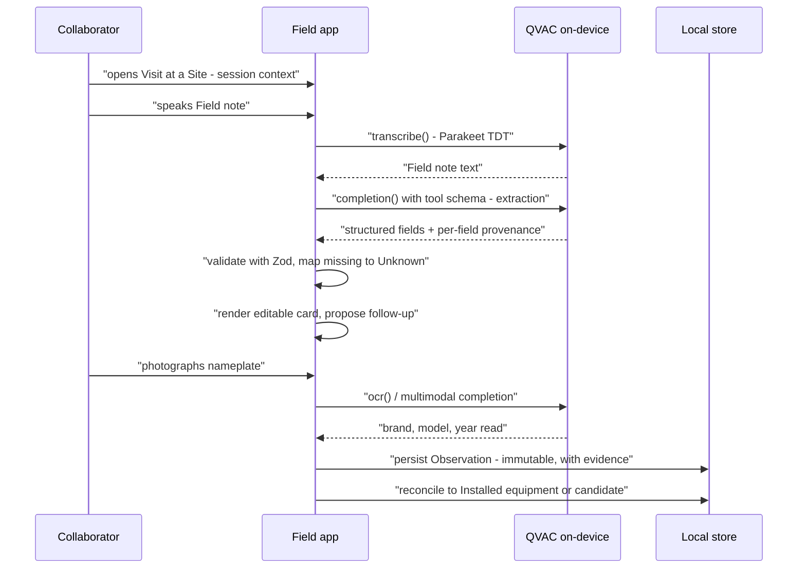
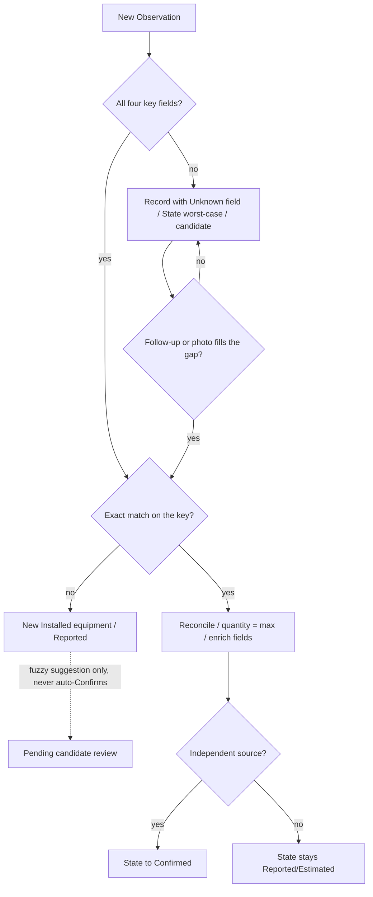
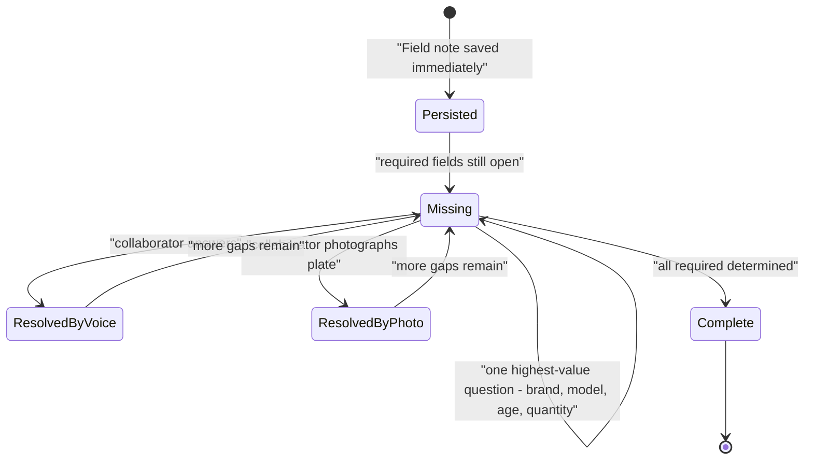
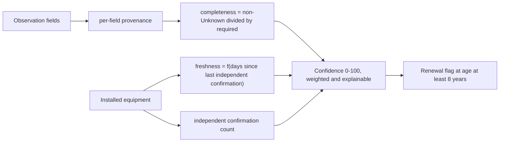

# Solution Proposal — FieldSight

**Working title:** FieldSight ("the installed base, seen clearly from the field").
Naming is an open decision — confirm or replace before the demo.

**Mission:** turn what a field collaborator observes in a hospital into structured, reliable data about installed medical equipment, with capture as simple as a conversation and every inference running on the device or between peers.

**Delivery form:** a **Web/Mobile app (Android/iOS)** — a mobile field app for capture and a local-first web dashboard for the installed base.

---

## 1. Mandatory rules — compliance before anything else

These come from `hackathon_rules/Reglas_Decentralized_AI_Hackathon.txt` and `hackathon_rules/TyC_Decentralized_AI_Hackathon.txt`, and they decide what we build and how we present it.

| Rule | Consequence for the build |
|---|---|
| All inference must run on-device or P2P via QVAC; cloud inference disqualifies the submission outright | Every AI step (transcription, extraction, OCR, vision, NL→query) calls the QVAC SDK. No cloud API is ever invoked. Verified in README + a design that leaves no cloud path. |
| Cloud may be used for *non-inference* functions (interface hosting, non-sensitive storage) | The dashboard could be hosted as pure UI, but we keep all data local-first because observations are sensitive client data. |
| Substantial product built within the 48h window; declared pre-existing base | We build our product code inside the window; README lists `create-expo-app`, `@qvac/sdk`, and open-source libraries as pre-existing. |
| Deliver repo (jury-accessible) + ≤5-min demo video in Spanish | The demo script (section 9) fits in 5 minutes and the product is a single offline story. |
| Evaluation: Technical 35% · Innovation 25% · Impact 20% · Design 10% · Completion 10% | We optimize for the three heavy criteria: genuine QVAC usage, a defensible novel angle, and a real commercial outcome (renewals). |

---

## 2. Shared understanding (the domain model we refined)

This repository already carries the refined domain model in `CONTEXT.md`, `docs/problem-statement.md`, and `docs/adr/`. The solution proposal is built on it, not around it.

| Decision | Where it lives |
|---|---|
| Client → Site is one-to-many; Observation anchors to a Site and inherits Client, city, country | `CONTEXT.md` — Client, Site |
| Observation is keyed by Site × Modality × brand × model; the Field note decides the count (specificity) | `CONTEXT.md` — Observation |
| Modality is a closed but broad controlled vocabulary (+ Other); aliases resolve to the canonical term | `CONTEXT.md` — Modality |
| State is per-field provenance; record State = worst case (Confirmed > Reported > Estimated > Unknown) | `CONTEXT.md` — State; `ADR 0003` |
| Installed-equipment matching is strict on all four key fields; a missing field creates a record until the gap fills | `CONTEXT.md` — Independent confirmation; `ADR 0002` |
| Quantity reconciles by max; "one of the X" references the group, it is not a count | `CONTEXT.md` — Installed equipment; session Q16–18 |
| Confidence (0–100) = completeness (non-Unknown ÷ required) + freshness (time since last independent confirmation) + independent confirmations; explainable weights | `CONTEXT.md` — Confidence score |
| Age = years the equipment has been in service; plate year is a proxy → Estimated; renewal fires at ≥8 years (Estimated counts, Unknown does not) | `CONTEXT.md` — Renewal opportunity |
| Follow-up asks one field per turn, highest-value first; the Observation persists immediately, never blocked | session Q9–10 |
| Photo can create or confirm; plate photo + second collaborator are the only independent sources | session Q11 |
| Transcription is a capture mechanism; the transcription *is* the Field note | session Q12 |
| Collaborator and Visit are first-class: confirmation is independent only across different Collaborators/Visits | `CONTEXT.md` — Collaborator, Visit |
| Field notes are accepted in any language; output normalizes to the English Modality canon | session Q18 |
| Site resolves from the active session context; QVAC verifies if the Field note names another | session Q17 |

---

## 3. Product overview

FieldSight is two surfaces over one shared, offline-first core:

1. **Field app (Android/iOS)** — the collaborator's capture tool. Talk, type, or photograph; QVAC extracts structured evidence locally; nothing leaves the device.
2. **Dashboard (web, local-first)** — the installed-base view for the organization: confidence per record, provenance drill-down, renewal radar, and natural-language queries — all resolved against data that lives on the user's machine.

The demo tells one vertical slice end-to-end:

> **One conversation + one photo → one traceable Observation → one Confirmed Installed equipment → one renewal decision.**

---

## 4. Web/Mobile (Android/iOS) — why and how

QVAC's runtime matrix decides the shape: the JS/TS SDK (`@qvac/sdk`) runs on **Node.js, Bare, and Expo (Android/iOS)**. There is **no browser runtime** — the engines are native (`llamacpp`, Whisper/Parakeet, ONNX OCR, vision). The official QVAC tutorial for mobile is an Expo app using `react-native-bare-kit` + the `@qvac/sdk/expo-plugin` on a physical device.

Why not a plain website? A browser cannot host the QVAC worker. And why a dashboard at all? The installed-base view and renewals are where the business value materializes.

---

## 5. Architecture

### 5.1 QVAC capability mapping

Every AI step maps to a QVAC task with a concrete, small model — keeping the prototype lean and genuinely device-capped.

| Product step | QVAC task | Recommended model | Notes |
|---|---|---|---|
| Voice → Field note | Transcription (ASR, speech→text: `transcribe()` / `transcribeStream()`) | **Parakeet TDT 0.6B** (multilingual, ~750 MB) | Spanish/Portuguese/English; streaming + end-of-utterance |
| Field note → structured fields | Text generation (`completion()` + tool schema) | **LLAMA_3_2_1B_INST_Q4_0** or **QWEN3_600M_INST_Q4** | Tool-call JSON bridled by a Zod schema; KV cache per session |
| Photo plate → text | OCR (`ocr()`) | **OCR_LATIN** (CRAFT + recognizer) | Returns blocks with text + bbox + confidence |
| Photo → brand/model/age/read label | Multimodal (`completion()` + `projectionModelSrc`) | **VisionPsy-Nano 460M** + mmproj | Confirms or creates; image never leaves device |
| NL query → typed filter | Text generation (tool schema) | same 1B LLM | Never raw SQL — validated typed filter, deterministic query |
| Speaker / field note separation | Transcription diarization (optional) | Parakeet Sortformer | Nice-to-have, not MVP |
| Heavy inference on weak phones | Delegated inference P2P | `loadModel({ delegate: { providerPublicKey, fallbackToLocal: true } })` | Cold DHT bootstrap 15–45 s, then sub-second |

### 5.2 Field capture flow

### 5.3 Reconciliation and confirmation

Strict four-field matching (`ADR 0002`) with an explicit **unknown-field candidate** path, so partial reports never silently merge and never falsely confirm.

### 5.4 Follow-up conversation

### 5.5 Confidence score

A transparent, explainable formula — no second opaque signal.

Proposed weights (tuning parameters, not domain): 0.40 × completeness + 0.25 × freshness + 0.35 × confirmation. The UI always shows *why* a score is what it is.

### 5.6 Data and lineage model

| Entity | Role |
|---|---|
| `Evidence` | Source artifact: field_note (transcription), photo, typed entry. Holds raw content + QVAC task/model used. |
| `ExtractedValue` | One field value + provenance (Confirmed/Reported/Estimated/Unknown) + `evidenceId` + extraction confidence. |
| `Observation` | Structured record for one equipment group (key Site×Modality×brand×model), carrying modality, brand, model, age, quantity and the derived record State. Immutable; each source appends. |
| `Installed equipment` | Reconciled view per key, quantity = max, best current fields, confirmation count, last independent confirmation. Materialized incrementally, **recomputable from Observations**. |
| `Visit` / `Collaborator` | The independence backbone — only separate sources raise confirmed. |

---

## 6. Field app — mobile details (Android/iOS)

Stack and key decisions (grounded in the official QVAC Expo tutorial and docs):

- **Expo SDK 54 + TypeScript**; single codebase for Android and iOS.
- `@qvac/sdk` with peer deps `bare-rpc`, `react-native-bare-kit`, `bare-pack`; `@qvac/sdk/expo-plugin` in `app.json`; `qvac.config.json` enabling **only** the plugins the app needs (LLM completion, transcription, OCR, vision) to keep engine footprint small.
- **Physical device required** (engines do not run on emulators) — documented in README; demo deviceready plan from hour 1.
- Local store: `expo-sqlite` for the structured dataset + `expo-file-system` for photos/audio/files.
- Model distribution: `downloadAsset`/`loadModel` with `onProgress`, pause/resume, sharded models; models fetched from the **distributed model registry** or **peers** (no central AI service).
- Session flow: open Visit at a Site → talk/type/photo → confirm card → follow-up → save.
- Offline-first: everything runs with no connectivity; download + load is the only "ready" gate and is shown transparently in the UI.

---

## 7. Dashboard — web (local-first) details

- Hosted as a local web app (Node/Electron or Expo web) so QVAC inference stays on-device; the rules permit cloud interface hosting, but observations are sensitive, so data never leaves the user's machine unless shared P2P.
- Views: **Installed base** (filter by Client/Site/Modality/State/Confidence), **Evidence drill-down** (Field notes, photos, Collaborators, Visits, provenance per field), **Renewal radar** (age, quantity, confidence, "why flagged", verify now), **Aggregations** by geography.
- **Natural-language query**: QVAC converts the question to a validated typed filter (Zod); a deterministic local query executes it. Raw model SQL is never executed.
- Recomputable: recalculation from Observations is supported, so rule changes don't strand materialized state.

---

## 8. Delivery plan for the 48-hour window

### Must (vertical slice first, in order)

1. Expo app boots on a physical device with QVAC smoke test (model download → load → completion).
2. Field note capture (text first, then voice) → transcription → structured extraction (tool-schema JSON + Zod).
3. Observation persist with per-field provenance and record State.
4. Photo capture → plate read (OCR + VisionPsy) → completes brand/model/age.
5. Reconciliation with strict four-field matching + candidate path; seeded second-collaborator data raises a record to Confirmed.
6. Dashboard: installed base + evidence drill-down + confidence + renewal radar.
7. Fixtures: DemoCare Health Group, several Sites, several Collaborators/Visits, mixed States — so the dashboard is populated the moment the demo starts.
8. README with declared pre-existing base; 5-minute Spanish demo video.

### If time permits

- Streaming voice with end-of-turn; follow-up state machine fully wired to voice and photo.
- Natural-language query on the dashboard.
- P2P sync between two devices (collaborator phone ↔ office laptop) to show decentralized confirmation without a server.
- Geographic visualization.

### Won't (explicitly out of scope)

- Custom model training or on-device fine-tuning as a product feature (mention as roadmap only).
- Cloud sync, multi-tenant backend, enterprise auth, exhaustive device taxonomy.
- Autonomous fuzzy dedup — suggestions only, never silent confirmation.

---

## 9. Demo script (video ≤5 min, Spanish)

| Time | Beat |
|---|---|
| 0:00–0:35 | Problem: installed-equipment knowledge lives in personal notes; nothing is verified; renewals are guesses. |
| 0:35–1:30 | Offline field capture: collaborator dictates a Field note at a Site; local transcription + structured extraction; missing model triggers a follow-up. |
| 1:30–2:20 | Photo: collaborator photographs the nameplate; OCR + vision complete brand/model/age on-device; show the record card. |
| 2:20–3:20 | Reconciliation: a second Collaborator's report from another Visit matches exactly → State Confirmed; confidence explained. |
| 3:20–4:20 | Impact: installed-base dashboard, provenance drill-down, renewal radar, one NL query answered locally. |
| 4:20–5:00 | Differentiation: all QVAC tasks on-device (text/audio/vision/OCR), no cloud endpoint, P2P path, offline guarantee. |

---

## 10. Risks and mitigations

| Risk | Mitigation |
|---|---|
| **Disqualification**: an inference path that touches a cloud API | Architecture with no cloud path; no SDK call can route to a remote provider; README documents the QVAC-only route. |
| Extraction returns unstable/invalid JSON | Tool-schema output + Zod validation + local retry; never invent values — map missing to Unknown/Estimated. |
| Vision/OCR fails on a plate | Manual correction path (Reported), follow-up asks to re-photograph; OCR blocks carry confidence. |
| Weak phone hardware / slow models | Model plan tiers (1B default, 600M fallback); P2P delegation with `fallbackToLocal`; model download progress UI. |
| Expo/engines do not run on emulator | Physical device tested on day 1; README states the requirement. |
| Scope creep over 48h | Vertical slice first; everything beyond "Must" is explicitly cut. |
| Pre-existing work undeclared | README `Pre-existing work and sources` section written on day 1, listing templates and libraries. |

---

## 11. Repository hygiene

- `README.md`: product one-liner, run instructions, physical-device requirement, `Pre-existing work and sources`, QVAC capability map, and a note that every inference is on-device or P2P.
- `docs/`: this proposal, `problem-statement.md`, `CONTEXT.md` glossary, ADRs.
- Demo fixtures checked in so the jury can replay the story offline.